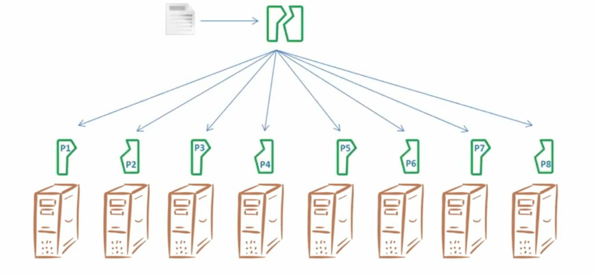
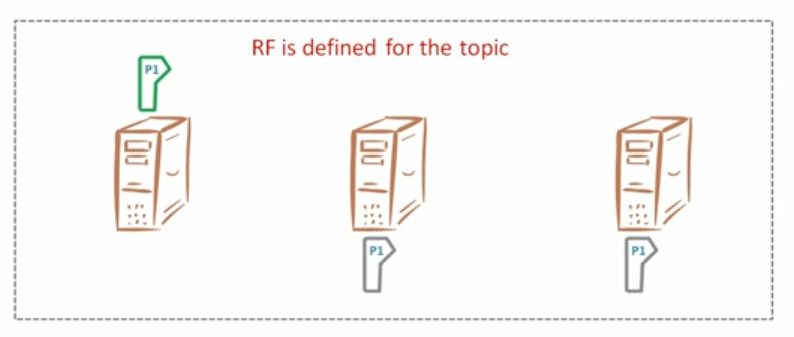
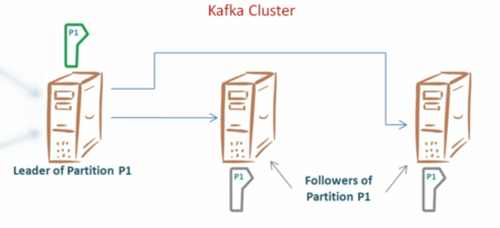
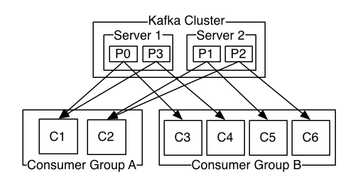
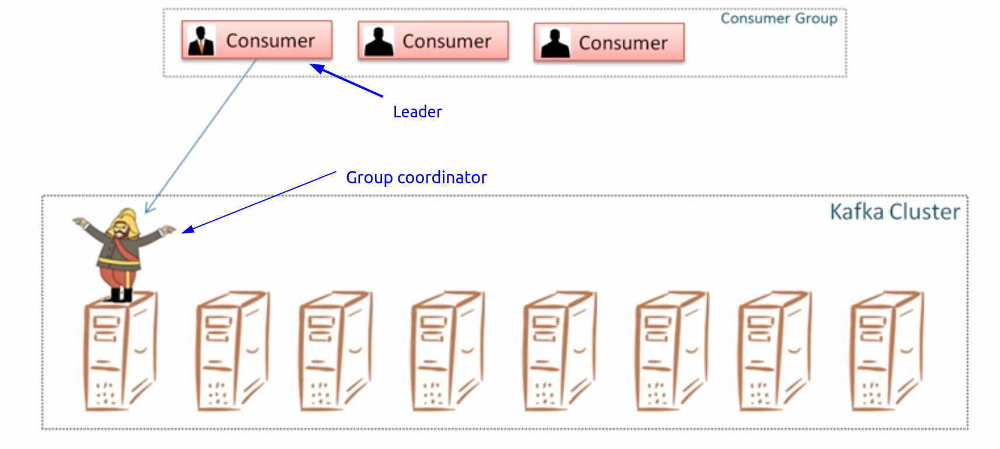

# Kafka 
We need zookeeper server to be installed to run kafka
#### basic installation:
>sudo apt-get install openjdk-8-jdk  
>sudo apt-get install zookeeperd  
>systemctl status zookeeper

It should be active. We can manage zookeeper service from now on. We may want to
enable automatic start of zookeeper service :)

Kafka executable can be downloaded from the [website](https://kafka.apache.org/downloads)
(i downloaded the latest scala 2.12 version of kafka)

Then we unpack kafka files to any folder, for example '/opt/kafka'

#### usage:
We need to locate the folder, where kafka is installed ('/opt/kafka' in my case).
To start kafka server we 'cd' in our kafka folder and write
>bin/kafka-server-start.sh config/server.properties

(It asked for sudo, when i did it)  
We can change properties in config/server.properties file

#### documentations:
* [kafka-python documentation](https://kafka-python.readthedocs.io/en/master/index.html)
* [confluent-kafka documentation](https://docs.confluent.io/current/clients/confluent-kafka-python/)

  
Apache Kafka is a message manager on the Java. 
There are publishers and consumers in kafka. Each message has it's topic. 
Topics are divided into partitions and partitions are running on broker
servers. 
Basically queues of messages are spread across different broker servers. To
prevent any issues, partitions are usually getting copied to another broker
servers, so we get multiple servers storing same parts of data.
ZooKeeper is used for managing and coordinating Kafka broker. ZooKeeper
service is mainly used to notify producer and consumer about the presence of 
any new broker in the Kafka system or failure of the broker in the Kafka 
system. As per the notification received by the Zookeeper regarding presence 
or failure of the broker then producer and consumer takes decision and 
starts coordinating their task with some other broker.
[More information](https://www.tutorialspoint.com/apache_kafka/apache_kafka_fundamentals.htm)  

For building large applications, **topics may be divided into partitions**. That
helps to get rid of overload for one broker. **Each partition is a new broker
server.** We define number of partitions when creating topic.
  
We also define a number of replications for each partition. Number
of replications can't be applied to a single partition, it's shared across 
partitions of one topic. Replication factor - number of copies of each
partition (usually around 3).
  
Group of servers which store the same data is called clusters. Cluster has
the leader partition and following partitions. If the leader partition fails,
the next partition becomes the leader.
  
[multi-broker cluster example](https://kafka.apache.org/documentation/#quickstart_multibroker)

 
For handling messages consuming we create multiple consumers, but it
is unclear, which source should consumer read. Consumer groups were created
to handle this problem. When creating a consumer, we define it's consumer
group id and many more. **Consumers in one consumer group can't share a
partition**, thus they can't both read same messages in parallel. You can't 
have more consumers than partitions, extra consumers will read nothing -> be
useless.

When number of consumers change, the connections between partitions
and consumers are **rebalanced** by the 'group coordinator' and 'leader'. 
Group coordinator - first server in a cluster. Leader - first joined consumer 
from the group. Coordinator modifies the list of members every time consumers
join or leave the group and initiates the rebalance activity. Leader executes
the rebalance activity by assigning new partitions to clusters, then it sends
the information about assigned partitions to coordinator. Coordinator sends
consumers the information about their new partitions.

To locate the needed message we need to know the **topic, partition and
offset.**

Each message has it's offset, it's his number in a queue. Queue doesn't get
deleted after being read, it is stored for some time that you can set yourself
(default - 3 days). There are 2 types of offset in kafka: current offset, 
commited offset. Current offset - number of messages that got taken by
consumer. Commited offset - number of messages that got processed by consumer. 
Current offset is needed to avoid resending same messages.
Commited offset is needed to avoid resending messages after partitions
rebalancing.
Commits may be automatic or manual. Autocommit is enabled by default. Also
commits can be sync or async. Async commits don't retry.

When creating a producer we have different parameters. We can use message
acknowledgement system if loosing data is unacceptable, we can also set the
number of retries and many more.

